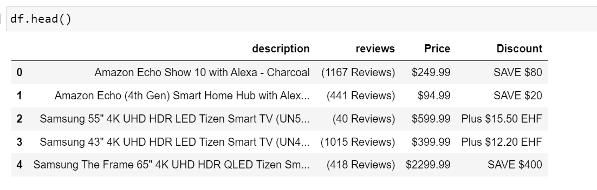

# BestBuy-project3
Project 3 for Data Analytics Bootcamp UofT

                   

We analysed our data from the BestBuy's website, usinf web scraping we focused on the TV categories. 
We scrapped the entire page https://www.bestbuy.ca/en-ca/category/televisions/21344 using an automation code to get our data.
We were able to get the description of all televisions BestBuy sells and then cleaned up the data using pandas.
After the cleaned up, our data looked like this:

               

Thereafter, we pushed the data into the database using PostgreSQL. we created a python Flask API which included the HTML/CSS, JavaScript.

Overall, this Flask application provides functionality for retrieving and displaying TV listings, performing searches, and generating different types of graphs based on the data stored in a PostgreSQL database.

