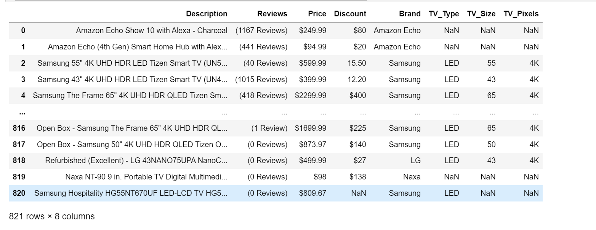

# cdn-tire-project3
Project 3 for Data Analytics Bootcamp UofT

We analysed our data from the BestBuy's website, usinf web scraping we focused on the TV categories. 
We scrapped the entire page https://www.bestbuy.ca/en-ca/category/televisions/21344 using an automation code to get our data.
We were able to get the description of all televisions BestBuy sells and then cleaned up the data using pandas.
After the cleaned up, our data looked like this:

Thereafter, we pused the data into the database using pgAdmin4,  and then connected our server to create our flask